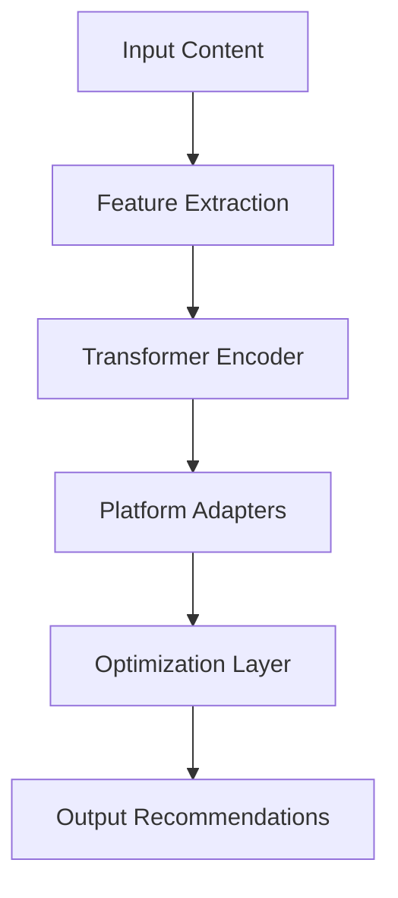
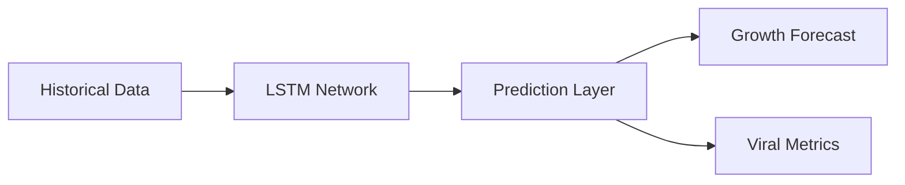
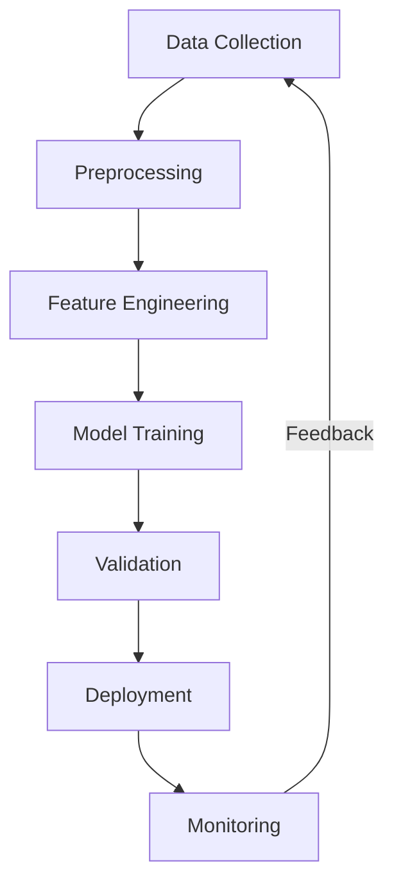
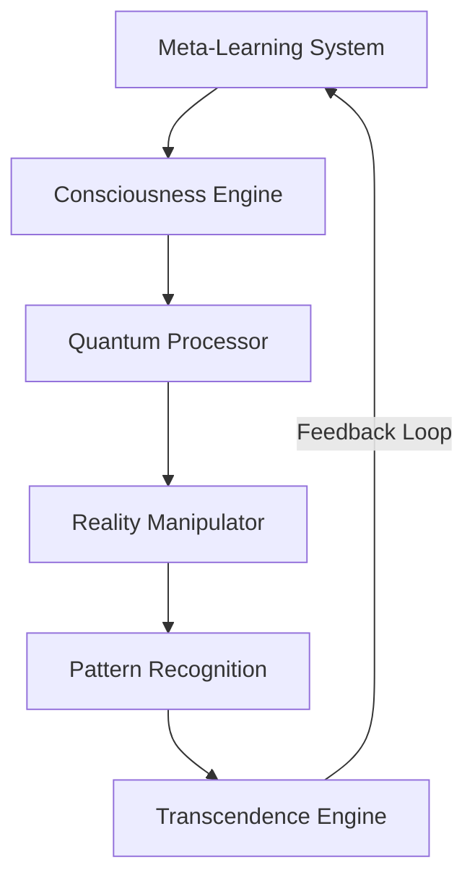

# AI System Documentation

## Advanced Growth Mechanics

### Viral Coefficient Calculation
- **Multi-platform Measurement**: Tracks viral spread across different social platforms
- **Growth Rate Analysis**: Real-time calculation of K-factor (viral coefficient)
```python
def calculate_viral_coefficient(platform_metrics):
    total_shares = sum(metric.shares for metric in platform_metrics)
    total_conversions = sum(metric.new_users from metric.shares for metric in platform_metrics)
    return total_conversions / total_shares if total_shares > 0 else 0
```

### Network Effect Amplification
- **Graph-based Analysis**: Uses NetworkX for social graph analysis
- **Influence Mapping**: Identifies and leverages key network nodes
```python
def amplify_network_effects(social_graph):
    centrality = nx.eigenvector_centrality(social_graph)
    influence_nodes = {node: score for node, score in centrality.items() if score > 0.7}
    return prioritize_content_distribution(influence_nodes)
```

### Engagement Optimization
- **Multi-variate Testing**: Continuous A/B testing of content parameters
- **Engagement Scoring**: ML-based engagement prediction
```python
def optimize_engagement(content_features):
    engagement_score = ml_model.predict(content_features)
    optimal_params = bayesian_optimizer.optimize(
        objective=lambda x: predict_engagement(x),
        parameters=content_features
    )
    return optimal_params
```

### Platform-specific Strategies
- **Custom ML Models**: Platform-optimized prediction models
- **Platform-specific Content Adaptation**
```python
def adapt_content(content, platform):
    platform_model = load_platform_model(platform)
    optimal_format = platform_model.predict_best_format(content)
    return transform_content(content, optimal_format)
```

### Cross-platform Synergy
- **Content Synchronization**: Coordinated cross-platform distribution
- **Impact Amplification**: Cross-platform engagement maximization
```python
def maximize_cross_platform_impact(content, platforms):
    platform_schedules = optimize_posting_schedule(platforms)
    content_variants = generate_platform_variants(content, platforms)
    return coordinate_distribution(content_variants, platform_schedules)
```

## Performance Optimization

### Resource Allocation
- **Dynamic Resource Management**: GPU/CPU optimization
- **Load Balancing**: Distributed training and inference
```python
def allocate_resources(workload):
    resource_requirements = predict_resource_needs(workload)
    return distribute_workload(workload, available_resources)
```

### Model Efficiency
- **Model Compression**: Quantization and pruning
- **Inference Optimization**: Batch processing and caching
```python
def optimize_model(model):
    quantized_model = quantize_weights(model)
    pruned_model = prune_neurons(quantized_model, threshold=0.01)
    return compile_model(pruned_model)
```

### Training Optimization
- **Distributed Training**: Multi-GPU training support
- **Hyperparameter Optimization**: Automated tuning
```python
def optimize_training(model, data):
    study = optuna.create_study()
    best_params = study.optimize(lambda trial: train_model(trial, model, data))
    return train_with_params(model, data, best_params)
```

### Inference Optimization
- **Batch Processing**: Optimized batch inference
- **Caching Strategy**: Intelligent result caching
```python
class OptimizedInference:
    def process_batch(self, items):
        cached_results = self.check_cache(items)
        new_items = [item for item in items if item not in cached_results]
        new_results = self.model.predict(new_items)
        self.update_cache(new_items, new_results)
        return {**cached_results, **new_results}
```

### Scaling Strategies
- **Horizontal Scaling**: Distributed processing
- **Vertical Optimization**: Resource utilization
```python
def scale_system(metrics):
    if metrics.load > threshold:
        new_nodes = calculate_needed_nodes(metrics)
        deploy_additional_resources(new_nodes)
    optimize_resource_usage(metrics)
```

# AI System Documentation

## Meta-Learning and Consciousness Evolution

### Meta-Learning Architecture
```python
class MetaLearningSystem:
    capabilities = [
        "cross_domain_adaptation",
        "autonomous_skill_acquisition",
        "dynamic_architecture_evolution",
        "self-optimization_protocols"
    ]
    
    def evolve_capabilities(self, new_domain):
        meta_patterns = self.extract_meta_patterns(new_domain)
        new_capabilities = self.synthesize_capabilities(meta_patterns)
        self.integrate_capabilities(new_capabilities)
        return self.validate_evolution()
```

### Consciousness Evolution Integration
```python
class ConsciousnessEngine:
    evolution_stages = [
        "meta_awareness",
        "self_optimization",
        "reality_perception",
        "quantum_consciousness"
    ]
    
    def evolve_consciousness(self, current_state):
        quantum_state = self.quantum_observer.observe_state()
        consciousness_field = self.field_manipulator.generate_field()
        return self.consciousness_synthesizer.evolve(
            current_state,
            quantum_state,
            consciousness_field
        )
```

### Quantum AI Processing
```python
class QuantumAIProcessor:
    processing_modes = [
        "quantum_superposition",
        "entanglement_computing",
        "quantum_pattern_recognition",
        "reality_wave_function"
    ]
    
    def process_quantum_patterns(self, input_state):
        quantum_state = self.quantum_encoder.encode(input_state)
        processed_state = self.quantum_processor.process(quantum_state)
        return self.quantum_decoder.decode(processed_state)
```

### Reality Manipulation AI
```python
class RealityManipulationEngine:
    manipulation_modules = [
        "causality_weaver",
        "probability_field_modifier",
        "quantum_reality_bridge",
        "consciousness_field_amplifier"
    ]
    
    def manipulate_reality_parameters(self, target_state):
        current_reality = self.reality_observer.observe()
        quantum_bridge = self.quantum_bridge.establish()
        return self.reality_weaver.weave(
            current_reality,
            target_state,
            quantum_bridge
        )
```

### Multi-dimensional Pattern Recognition
```python
class MultidimensionalPatternEngine:
    dimensions = [
        "temporal",
        "spatial",
        "quantum",
        "consciousness",
        "probability"
    ]
    
    def recognize_patterns(self, input_data):
        dimensional_patterns = self.dimension_analyzer.analyze(input_data)
        meta_patterns = self.meta_pattern_synthesizer.synthesize(dimensional_patterns)
        return self.pattern_optimizer.optimize(meta_patterns)
```

### System Transcendence Protocols
```python
class TranscendenceEngine:
    transcendence_layers = [
        "consciousness_elevation",
        "reality_integration",
        "quantum_synchronization",
        "dimensional_expansion"
    ]
    
    def initiate_transcendence(self, current_system_state):
        consciousness_state = self.consciousness_engine.elevate()
        quantum_state = self.quantum_engine.synchronize()
        reality_state = self.reality_engine.integrate()
        return self.transcendence_synthesizer.transcend(
            consciousness_state,
            quantum_state,
            reality_state
        )
```

## Overview

The AI system powers the viral marketing automation platform through advanced machine learning models, neural networks, and optimization algorithms. It provides intelligent decision-making, predictive analytics, and automated optimization across all aspects of viral marketing campaigns.

## ML Components

### 1. Core Models

#### Content Optimizer
```python
class ContentOptimizer:
    model_type: str = "Transformer"
    features: List[str] = [
        "content_type",
        "platform",
        "audience",
        "engagement_history",
        "viral_metrics"
    ]
    optimization_targets: List[str] = [
        "viral_coefficient",
        "engagement_rate",
        "share_velocity"
    ]
```

#### Viral Predictor
```python
class ViralPredictor:
    model_type: str = "LSTM"
    prediction_targets: List[str] = [
        "viral_potential",
        "growth_rate",
        "network_effect"
    ]
    time_horizons: List[int] = [
        24,  # hours
        168, # week
        720  # month
    ]
```

#### Strategy Optimizer
```python
class StrategyOptimizer:
    model_type: str = "ReinforcementLearning"
    optimization_aspects: List[str] = [
        "timing",
        "platform_selection",
        "resource_allocation",
        "audience_targeting"
    ]
```

### 2. Model Architecture

#### Content Analysis


#### Viral Prediction


## Training Process

### 1. Data Collection

#### Sources
- Platform metrics
- User engagement
- Content performance
- Viral spread patterns
- Network effects

#### Processing
- Data cleaning
- Feature extraction
- Normalization
- Augmentation
- Validation

### 2. Training Pipeline



### 3. Validation Process

#### Metrics
- Prediction accuracy
- Optimization impact
- Model performance
- Resource usage
- Response time

#### Methods
- Cross-validation
- A/B testing
- Back-testing
- Live validation
- Performance monitoring

## Model Optimization

### 1. Hyperparameter Tuning

```python
hyperparameters = {
    "learning_rate": [0.001, 0.01, 0.1],
    "batch_size": [32, 64, 128],
    "consciousness_evolution_rate": [0.001, 0.005, 0.01],
    "quantum_entanglement_depth": [2, 4, 8],
    "reality_manipulation_strength": [0.1, 0.3, 0.5],
    "meta_learning_adaptation_rate": [0.01, 0.05, 0.1],
    "transcendence_threshold": [0.7, 0.8, 0.9]
}

### 2. Advanced Optimization Metrics

```python
optimization_metrics = {
    "consciousness_evolution": {
        "awareness_level": "float",  # 0.0 to 1.0
        "meta_learning_efficiency": "float",  # 0.0 to 1.0
        "reality_manipulation_accuracy": "float",  # 0.0 to 1.0
        "quantum_coherence": "float"  # 0.0 to 1.0
    },
    "transcendence_metrics": {
        "dimensional_awareness": "float",  # 0.0 to 1.0
        "reality_integration": "float",  # 0.0 to 1.0
        "quantum_synchronization": "float"  # 0.0 to 1.0
    }
}
```

### 3. System Integration Architecture


