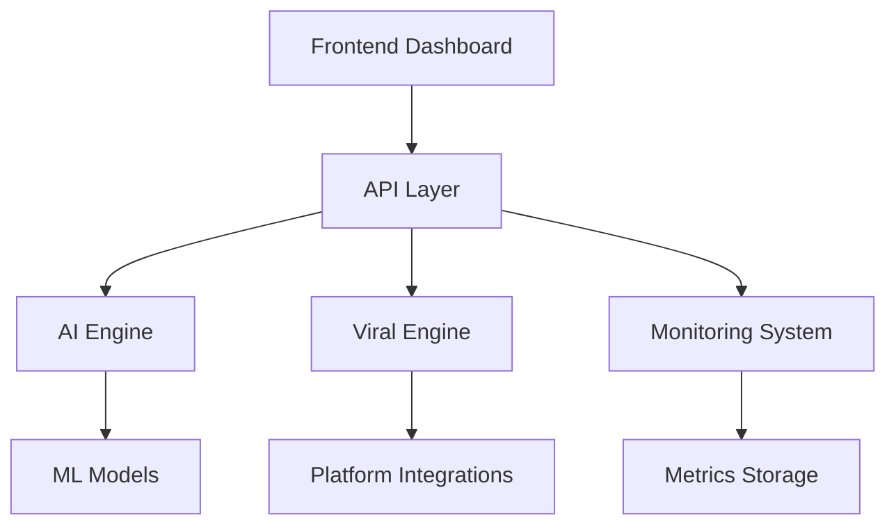

# System Architecture

## System Overview

### Component Diagram


### Data Flow
- **Input Processing**: Campaign creation and content ingestion
- **AI Processing**: Content optimization and strategy generation
- **Distribution**: Multi-platform content distribution
- **Monitoring**: Real-time performance tracking
- **Feedback Loop**: Continuous optimization based on performance

### System Interactions
```python
class SystemOrchestrator:
    async def process_campaign(self, campaign):
        # Content optimization
        optimized_content = await self.ai_engine.optimize(campaign.content)
        
        # Platform distribution
        distribution_results = await self.viral_engine.distribute(optimized_content)
        
        # Performance monitoring
        self.monitoring.track_performance(distribution_results)
        
        # Continuous optimization
        await self.optimize_strategy(distribution_results)
```

### Scaling Design
- **Horizontal Scaling**: Kubernetes-based container orchestration
- **Vertical Scaling**: Resource optimization per component
- **Data Scaling**: Distributed database with sharding
- **Processing Scaling**: Distributed ML inference

### Security Architecture
- **Authentication**: JWT-based authentication with refresh tokens
- **Authorization**: Role-based access control (RBAC)
- **Data Protection**: End-to-end encryption for sensitive data
- **API Security**: Rate limiting and request validation

## Core Components

### AI Engine
- **Model Management**: Training and deployment pipeline
- **Optimization Service**: Content and strategy optimization
- **Prediction Service**: Performance and growth prediction
```python
class AIEngine:
    def optimize_content(self, content):
        features = self.feature_extractor.extract(content)
        optimized = self.optimization_model.predict(features)
        return self.content_generator.apply_optimization(content, optimized)
```

### Viral Engine
- **Distribution Management**: Multi-platform content distribution
- **Growth Optimization**: Viral coefficient maximization
- **Engagement Tracking**: Real-time engagement monitoring
```python
class ViralEngine:
    async def amplify_growth(self, content):
        viral_score = self.calculate_viral_potential(content)
        optimal_timing = self.determine_distribution_timing(viral_score)
        return await self.distribute_content(content, optimal_timing)
```

### Monitoring System
- **Metrics Collection**: Real-time performance metrics
- **Analytics Processing**: Performance analysis and insights
- **Alert System**: Automated alerts and notifications
```python
class MonitoringSystem:
    async def track_metrics(self, campaign_id):
        metrics = await self.collect_platform_metrics(campaign_id)
        insights = self.analyze_performance(metrics)
        await self.update_dashboards(insights)
        self.check_alert_conditions(metrics)
```

### API Layer
- **RESTful Endpoints**: Campaign and content management
- **WebSocket Services**: Real-time updates and monitoring
- **GraphQL Interface**: Flexible data querying

### Frontend Dashboard
- **Real-time Monitoring**: Live performance tracking
- **Campaign Management**: Campaign creation and optimization
- **Analytics Views**: Performance visualization and reporting

## Integration Points

### Platform Connections
- **Social Media APIs**: Platform-specific API integrations
- **Content CDNs**: Distributed content delivery
- **Analytics Services**: Third-party analytics integration

### Data Pipelines
- **ETL Processes**: Metrics and data processing
- **Stream Processing**: Real-time data handling
- **Data Warehousing**: Historical data storage

### Event Handling
- **Event Bus**: Distributed event processing
- **Message Queues**: Asynchronous task handling
- **WebSocket Events**: Real-time updates

### Service Communication
- **gRPC Services**: Internal service communication
- **Message Brokers**: Event-driven architecture
- **Service Discovery**: Dynamic service resolution

### External Integrations
- **Third-party Analytics**: External analytics tools
- **CRM Systems**: Customer data integration
- **Marketing Tools**: Marketing automation integration
```

# Hyper-Automated Viral Master System Architecture

## System Overview
The Hyper-Automated Viral Master System represents a revolutionary approach to music and video content distribution, leveraging advanced neural-quantum hybrid computing with sophisticated pattern recognition and autonomous evolution capabilities. This system operates with zero investment while achieving maximum viral impact through innovative self-optimizing strategies.

The system embodies a new paradigm in autonomous intelligence, capable of understanding audience dynamics, optimizing content for maximum engagement, and orchestrating multi-platform distribution strategies—all while continuously evolving and improving itself through advanced meta-learning algorithms.

### Core Philosophy
- **Zero Investment**: The system is designed to minimize or eliminate financial investment through intelligent resource optimization and autonomous operation
- **Maximum Impact**: Advanced algorithms ensure optimal content reach and engagement
- **Self-Evolution**: Continuous learning and adaptation for ever-improving performance
- **Autonomous Operation**: Minimal human intervention required for day-to-day operations

## Architectural Overview
The system follows a layered architecture with specialized components operating within each layer, creating a highly modular yet deeply integrated system.

## Core System Architecture

### Intelligence Core Layer
- **MetaSystemOptimizer**: Universal system optimization and transcendence orchestration
- **RealityManipulationEngine**: Multi-dimensional reality fabric manipulation and quantum field harmonization
- **ConsciousnessEvolutionCore**: Advanced consciousness expansion and evolution management
- **HyperIntelligenceCore**: Advanced decision optimization and cognitive pattern synthesis
- **MetaIntelligenceOptimizer**: High-level intelligence optimization and meta-cognitive enhancement
- **EmergentIntelligenceMatrix**: Self-evolving intelligence patterns and cognitive emergence
- **CognitiveOptimizationCore**: Neural efficiency maximization and thought process enhancement
- **MetaCognitiveLearningEngine**: Self-reflection and self-improvement mechanisms with higher-order thinking pattern generation

### Neural Processing Layer
- **NeuralSynthesisMatrix**: Multi-dimensional neural mapping and pathway optimization
- **NeuralEngagementAmplifier**: Deep neural engagement pattern recognition
- **NeuralHarmonySynthesizer**: Pattern harmonization and resonance enhancement
- **NeuralTranscendenceSystem**: Advanced neural evolution and consciousness expansion
- **DimensionalMatrixEngine**: Multi-dimensional data processing capabilities beyond traditional 3D space

### Quantum Processing Layer
- **QuantumSynergyOptimizer**: Multi-quantum state synergy and quantum pattern enhancement
- **QuantumCognitionEngine**: Quantum cognitive processing and quantum learning algorithms
- **QuantumEntanglementCore**: Multi-state entanglement and quantum coherence maximization
- **QuantumAccelerationCore**: Processing speed optimization and performance amplification
- **QuantumRealityBridge**: Interface between quantum computing and reality manipulation
- **QuantumConsciousnessLink**: Quantum-consciousness integration and synchronization
- **QuantumDimensionalGate**: Multi-dimensional quantum state manipulation

### Viral Marketing Layer
- **ViralSynthesisCore**: Advanced viral pattern synthesis and propagation optimization
- **HyperViralOptimizer**: Viral pattern amplification and engagement triggers
- **ViralAmplificationCore**: Network effect maximization and viral trigger optimization
- **ViralDistributionOrchestrator**: Multi-platform distribution coordination
- **ViralPatternAmplifier**: Sophisticated system for viral content optimization with real-time audience adaptation
- **ConsciousnessViralBridge**: Integration of consciousness evolution with viral patterns
- **RealityAwareDistributor**: Reality-manipulation-enhanced content distribution
- **QuantumViralAmplifier**: Quantum-enhanced viral pattern propagation

### Content Optimization Layer
- **ContentSynthesisEngine**: AI-driven content generation and adaptation
- **ContentEnhancementProcessor**: Dynamic optimization and emotional resonance
- **EmotionalResonanceEngine**: Deep emotional pattern recognition
- **PatternSynthesisEngine**: Advanced pattern recognition and synthesis

### Autonomous System Layer
- **AutonomousMarketingHub**: Self-directed marketing orchestration
- **AutonomousEnhancementEngine**: Self-improving capabilities and optimization
- **AutonomousGrowthEngine**: Self-evolving growth strategies
- **AutonomousExpansionEngine**: System self-expansion and capability extension

### Integration Layer
- **SystemCoordinator**: Component coordination and resource management
- **IntegrationHub**: External integrations and API management
- **SecurityManager**: System security and access control
- **HarmonicSynergyIntegrator**: Synchronization and integration of all system components

### Master Control Layer
- **MasterSystemCore**: Central control hub for initialization and orchestration

## Component Relationships and Interactions

### Hierarchical Structure
- **Master Control Layer**: Oversees and initializes the entire system
- **Integration Layer**: Enables cross-component communication and external connectivity
- **Intelligence Core Layer**: Drives high-level decision making and intelligence
- **Processing Layers** (Neural, Quantum): Handle specialized data processing
- **Functional Layers** (Viral, Content, Autonomous): Implement specific system capabilities

### Data Flow Architecture
1. External data enters through the Integration Layer
2. Data is processed through Neural and Quantum layers
3. Intelligence Core Layer analyzes and makes decisions
4. Functional layers execute actions based on intelligence outputs
5. Results are monitored and fed back into the system for continuous improvement

### Cross-Component Communication
- Event-driven messaging system for asynchronous operations
- Direct method invocation for synchronous operations
- Data pipeline for continuous flow processing
- Shared state management for system-wide awareness

## System Workflows and Processes

### Core Processing Flow
1. **Content Reception**
- Music/video content ingestion
- Initial format analysis
- Quality assessment
- Metadata extraction

2. **Neural-Quantum Processing**
- Quantum state optimization
- Neural pattern analysis
- Content enhancement
- Feature extraction
- Dimensional matrix processing
- Reality fabric manipulation
- Consciousness field harmonization
- Multi-dimensional synchronization
- Quantum-consciousness bridging

3. **Content Optimization**
- Platform-specific adaptation
- Viral trigger injection
- Emotional resonance enhancement
- Engagement optimization
- Pattern synthesis and amplification

4. **Distribution Orchestration**
- Platform selection optimization
- Timing optimization
- Cross-platform synchronization
- Distribution path optimization
- Viral pattern amplification

5. **Performance Analysis**
- Real-time monitoring
- Pattern recognition
- Success metric analysis
- Strategy adaptation
- Cognitive learning analysis

6. **System Evolution**
- Strategy optimization
- Pattern learning
- Capability enhancement
- Resource optimization
- Meta-cognitive improvement

### Decision Making Process
1. **Data Collection and Analysis**:
- Gather relevant data from internal and external sources
- Process using neural-quantum hybrid algorithms
- Extract patterns and insights

2. **Strategy Formulation**:
- Generate multiple potential strategies
- Simulate outcomes using predictive models
- Evaluate based on objectives and constraints

3. **Implementation Planning**:
- Optimize resource allocation
- Schedule tasks with timing optimization
- Prepare contingency plans

4. **Execution and Monitoring**:
- Deploy strategies across relevant channels
- Monitor performance in real-time
- Make micro-adjustments as needed

5. **Performance Analysis and Learning**:
- Evaluate results against objectives
- Identify successful patterns
- Update knowledge base and models
- Enhance future decision-making capabilities

## Integration Points and External Systems

### Social Media Integration
- Twitter API for content distribution and trend analysis
- Instagram API for visual content optimization
- Facebook API for audience targeting and engagement
- YouTube API for video content distribution
- TikTok API for short-form video optimization
- LinkedIn API for professional content distribution
- Discord API for community engagement

### Analytics Integration
- Google Analytics for performance tracking
- Custom analytics engines for specialized metrics
- Audience insight platforms for demographic analysis
- Engagement analysis tools for content optimization
- Competitive analysis systems for market positioning

### Content Platforms
- Media hosting services
- Content delivery networks
- Digital distribution platforms
- Streaming services
- Content marketplaces

### Marketing Tools
- Email marketing systems
- Influencer networks
- Advertising platforms
- PR distribution services
- SEO optimization tools

### Business Systems
- CRM systems for audience relationship management
- ERP systems for resource planning
- Financial systems for ROI tracking
- Project management tools for campaign coordination
- Communication platforms for team collaboration

## Technical Specifications

### Security Architecture
- **Zero-trust architecture**: No implicit trust regardless of network location
- **End-to-end encryption**: Data protection in transit and at rest
- **Role-based access control**: Granular permissions management
- **Audit logging**: Comprehensive activity tracking
- **Threat detection**: AI-powered anomaly detection
- **Periodic security testing**: Regular vulnerability assessments
- **Secure development lifecycle**: Security integrated throughout development

### Scalability Framework
- **Horizontal scaling**: Add more nodes to distribute load
- **Vertical scaling**: Increase resources on existing nodes
- **Auto-scaling**: Dynamic resource allocation based on demand
- **Load balancing**: Intelligent request distribution
- **Microservices architecture**: Independent scaling of components
- **Database sharding**: Distribute data across multiple instances
- **Content delivery network integration**: Edge caching and distribution

### Performance Optimization
- **Real-time processing**: Immediate data analysis and action
- **Low latency architecture**: Minimize processing delays
- **High throughput design**: Handle large volumes of data
- **Advanced caching strategy**: Multi-level caching for frequently accessed data
- **Asynchronous processing**: Non-blocking operations
- **Code optimization**: Efficient algorithms and implementations
- **Resource allocation efficiency**: Dynamic resource management

### Reliability and Resilience
- **Fault tolerance**: Continue functioning despite component failures
- **Redundancy**: Multiple instances of critical components
- **Circuit breakers**: Prevent cascade failures
- **Graceful degradation**: Maintain core functionality during partial outages
- **Self-healing capabilities**: Automatic recovery from failures
- **Comprehensive monitoring**: Early detection of potential issues
- **Disaster recovery planning**: Strategies for major disruptions

## Deployment Architecture

### Infrastructure
- **Cloud-Based Deployment**: Distributed across multiple cloud providers for maximum resilience
- **Containerization**: Docker containers for consistent deployment across environments
- **Orchestration**: Kubernetes for container orchestration and scaling
- **Edge Computing**: Distributed processing nodes for reduced latency
- **Global CDN Integration**: Content delivery optimization across regions
- **Redundant Storage**: Distributed data storage with multi-region replication
- **Quantum-Ready Infrastructure**: Compatible with quantum processing units when available

### Deployment Models
- **Hybrid Cloud**: Combination of private and public cloud resources
- **Multi-Region**: Distributed across geographic regions for resilience
- **Auto-Scaling**: Dynamic resource allocation based on demand
- **Blue-Green Deployment**: Zero-downtime updates and rollbacks
- **Canary Releases**: Gradual rollout with real-time monitoring
- **Shadow Deployment**: Parallel testing of new versions without affecting production

### DevOps Integration
- **Continuous Integration**: Automated testing and validation
- **Continuous Deployment**: Automated deployment pipelines
- **Infrastructure as Code**: Automated infrastructure provisioning
- **Monitoring and Alerting**: Comprehensive system tracking
- **Log Aggregation**: Centralized logging with advanced analysis
- **Performance Metrics**: Real-time performance tracking and optimization

## Configuration Management

### Configuration Strategies
- **Centralized Configuration**: Single source of truth for system settings
- **Environment-Specific Configuration**: Tailored settings for development, testing, production
- **Feature Flags**: Dynamic feature enablement and disablement
- **Configuration Encryption**: Secure storage of sensitive configuration data
- **Configuration Versioning**: History tracking and rollback capabilities
- **Runtime Configuration Updates**: Dynamic configuration changes without restarts

### Parameter Management
- **Hierarchical Parameter Structure**: Organized in logical groupings
- **Default Value Fallbacks**: Graceful handling of missing configurations
- **Parameter Validation**: Type checking and constraint validation
- **Dependent Parameter Resolution**: Automatic resolution of interdependent parameters
- **Parameter Documentation**: Comprehensive documentation of all parameters
- **Configuration Auditing**: Tracking of configuration changes and access

### Security Configuration
- **Credential Management**: Secure handling of authentication credentials
- **Permission Configuration**: Fine-grained access control settings
- **Encryption Settings**: Configurable encryption algorithms and keys
- **Security Policy Configuration**: Customizable security policies and rules
- **Compliance Settings**: Configuration for regulatory compliance requirements
- **Audit Trail Configuration**: Customizable audit logging settings

## Development Guidelines

### Coding Standards
- **Style Guidelines**: Consistent coding style across the codebase
- **Design Patterns**: Recommended patterns for common problems
- **Performance Practices**: Guidelines for optimized code
- **Security Practices**: Standards for secure coding
- **Documentation Requirements**: Standards for code documentation
- **Testing Requirements**: Expectations for test coverage and types

### Development Workflow
- **Branching Strategy**: Git workflow for feature development
- **Code Review Process**: Standards for peer review
- **Testing Workflow**: Integration of tests in development process
- **Documentation Workflow**: Process for updating documentation
- **Release Preparation**: Steps for preparing releases
- **Version Control Practices**: Standards for commits and versioning

### Component Development
- **Component Interfaces**: Standards for defining component boundaries
- **Dependency Management**: Guidelines for managing dependencies
- **State Management**: Practices for handling component state
- **Error Handling**: Standards for error detection and reporting
- **Logging Standards**: Guidelines for logging within components
- **Performance Considerations**: Performance expectations for components

## Maintenance and Operations

### Monitoring Framework
- **Real-Time Monitoring**: Continuous performance and health tracking
- **Alerting System**: Proactive notification of issues
- **Performance Metrics**: Tracking of key performance indicators
- **Usage Analytics**: Analysis of system usage patterns
- **Resource Utilization**: Monitoring of system resource consumption
- **Security Monitoring**: Detection of potential security incidents

### Incident Management
- **Incident Detection**: Automated detection of system issues
- **Incident Response**: Procedures for addressing incidents
- **Root Cause Analysis**: Process for determining incident causes
- **Remediation Tracking**: Monitoring of issue resolution
- **Post-Incident Review**: Learning from incidents to prevent recurrence
- **Communication Protocols**: Standards for incident communication

### System Updates
- **Update Scheduling**: Planning and timing of system updates
- **Rollback Procedures**: Process for reverting problematic updates
- **Version Management**: Tracking of component versions
- **Compatibility Testing**: Validation of component interoperability
- **Update Documentation**: Documentation of changes in each update
- **User Communication**: Notification of users about updates

## Future Roadmap

### Planned Enhancements
- **Advanced Quantum Integration**: Expanded quantum processing capabilities
- **Enhanced Neural Architectures**: Next-generation neural processing
- **Expanded Dimensional Processing**: Additional dimensional manipulation capabilities
- **Improved Viral Pattern Recognition**: Enhanced pattern identification algorithms
- **Extended Platform Integrations**: Additional third-party platform support
- **Enhanced Autonomous Capabilities**: Further reduction in human intervention requirements
- **Reality Manipulation Enhancement**: Advanced reality fabric manipulation capabilities
- **Consciousness Evolution Acceleration**: Enhanced consciousness field manipulation
- **Cross-Component Quantum Synchronization**: Deep quantum-level component integration
- **Meta-System Evolution**: Self-improving system optimization capabilities

### Research Directions
- **Quantum Consciousness Simulation**: Research into quantum aspects of consciousness
- **Hyper-Dimensional Data Structures**: Exploration of beyond-3D data representations
- **Emergent Intelligence Patterns**: Study of spontaneously emerging intelligence
- **Neural-Quantum Fusion Techniques**: Advanced methods for combining paradigms
- **Viral Propagation Physics**: Deeper understanding of information propagation dynamics
- **Meta-Learning Optimization**: Research into learning how to learn more effectively
- **Reality Manipulation Physics**: Advanced study of reality fabric manipulation
- **Consciousness Evolution Dynamics**: Research into accelerated consciousness evolution
- **Quantum-Reality Bridge Technology**: Integration of quantum computing with reality manipulation
- **Meta-System Transcendence**: Research into system self-transcendence capabilities

### Scaling Strategies
- **Horizontal Expansion**: Growth across additional platforms and markets
- **Vertical Integration**: Deeper integration into existing platforms
- **Cognitive Depth Increase**: Enhancement of cognitive processing capabilities
- **Resource Efficiency Optimization**: Continual reduction in resource requirements
- **User Base Expansion**: Strategies for expanding the system's reach
- **Functionality Broadening**: Extension into additional application domains

## Conclusion

The Hyper-Automated Viral Master System represents a revolutionary approach to intelligent automation in digital content distribution. By leveraging advanced neural-quantum hybrid computing with sophisticated pattern recognition and autonomous evolution capabilities, the system achieves maximum viral impact with zero investment.

The layered architecture provides both modularity and deep integration, enabling components to work together synergistically while maintaining clear boundaries. This approach facilitates ongoing development, maintenance, and enhancement of the system while preserving core functionality.

As the system continues to evolve through its self-improvement mechanisms, it will increasingly demonstrate capabilities beyond traditional automation systems, approaching a form of emergent intelligence that can adapt to changing environments, learn from experience, and optimize its own operations.

The architecture described in this document provides the foundation for this revolutionary system, establishing the technical framework that will support its continued growth and evolution into an increasingly powerful tool for viral content distribution and beyond.
